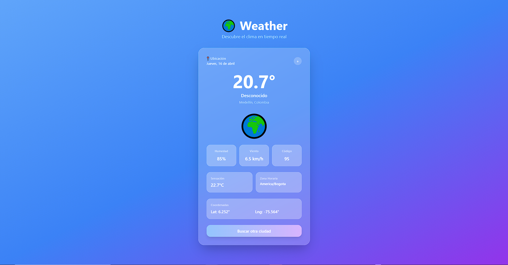

# 🌍 Weather App

Aplicación web para consultar el clima en tiempo real de cualquier ciudad del mundo, construida con **Next.js 15**, **React 19**, **TypeScript** y **Tailwind CSS**. Consume la API pública de [Open-Meteo](https://open-meteo.com/) sin necesidad de API key.



---

## Tabla de contenidos

1. [Stack tecnológico](#stack-tecnológico)
2. [Requisitos previos](#requisitos-previos)
3. [Instalación y configuración](#instalación-y-configuración)
4. [Variables de entorno](#variables-de-entorno)
5. [Comandos disponibles](#comandos-disponibles)
6. [Arquitectura del proyecto](#arquitectura-del-proyecto)
7. [Flujo de datos](#flujo-de-datos)
8. [Componentes](#componentes)
9. [Hook `useWeather`](#hook-useweather)
10. [Servicios internos (`lib/`)](#servicios-internos-lib)
11. [API externa — Open-Meteo](#api-externa--open-meteo)
12. [Sistema de caché](#sistema-de-caché)
13. [Manejo de errores](#manejo-de-errores)
14. [Seguridad](#seguridad)
15. [Testing](#testing)

---

## Stack tecnológico

| Capa | Tecnología | Versión |
|---|---|---|
| Framework | Next.js (App Router) | 15.x |
| UI | React | 19.x |
| Lenguaje | TypeScript | 5.x |
| Estilos | Tailwind CSS | 3.4 |
| HTTP Client | Axios | 1.15 |
| Testing | Jest + Testing Library | 29.x / 16.x |
| Linting/Format | ESLint + Prettier | 8.x / 3.x |

---

## Requisitos previos

- **Node.js** ≥ 18.17 (recomendado: 20 LTS)
- **npm** ≥ 9

---

## Instalación y configuración

```bash
# 1. Clonar el repositorio
git clone <url-del-repo>
cd weather-app

# 2. Instalar dependencias
npm install

# 3. Crear archivo de variables de entorno
cp .env.example .env.local

# 4. Iniciar servidor de desarrollo
npm run dev
```

La aplicación estará disponible en `http://localhost:3000`.

---

## Variables de entorno

Crea un archivo `.env.local` en la raíz del proyecto con las siguientes variables:

```env
# URL de la API de geocodificación de Open-Meteo
NEXT_PUBLIC_GEOCODE_URL=https://geocoding-api.open-meteo.com/v1/search

# URL de la API de clima de Open-Meteo
NEXT_PUBLIC_WEATHER_URL=https://api.open-meteo.com/v1/forecast

# Timeout de peticiones HTTP en milisegundos (default: 10000)
NEXT_PUBLIC_API_TIMEOUT=10000

# Idioma para los resultados de geocodificación (default: es)
NEXT_PUBLIC_API_LANGUAGE=es

# TTL del caché en milisegundos (default: 3600000 = 1 hora)
NEXT_PUBLIC_CACHE_TTL=3600000
```

> Todas las variables son públicas (`NEXT_PUBLIC_`) ya que se consumen en el cliente. No se manejan claves secretas.

---

## Comandos disponibles

```bash
npm run dev          # Servidor de desarrollo con hot reload
npm run build        # Build de producción optimizado
npm run start        # Servidor de producción (requiere build previo)
npm run lint         # Análisis estático con ESLint
npm run format       # Formateo de código con Prettier
npm test             # Ejecutar tests unitarios
npm run test:watch   # Tests en modo watch
npm run test:coverage  # Tests con reporte de cobertura
```

---

## Arquitectura del proyecto

```
weather-app/
├── src/
│   ├── app/
│   │   ├── layout.tsx          # Layout raíz: metadata, viewport, estilos globales
│   │   └── page.tsx            # Página principal — renderiza WeatherDisplay
│   │
│   ├── components/
│   │   ├── WeatherDisplay.tsx  # Componente principal (Client Component)
│   │   └── ErrorModal.tsx      # Modal de error con auto-cierre
│   │
│   ├── hooks/
│   │   └── useWeather.ts       # Hook de estado: loading, weather, error
│   │
│   ├── lib/
│   │   ├── weatherService.ts   # Lógica de negocio y llamadas a Open-Meteo
│   │   ├── cacheService.ts     # Caché en sessionStorage con fallback a memoria
│   │   ├── errorService.ts     # Clase ApiError y clasificación de errores
│   │   ├── validationService.ts # Validación de entrada y coordenadas
│   │   ├── debugService.ts     # Logging condicional (solo desarrollo)
│   │   ├── config.ts           # Constantes de configuración centralizadas
│   │   └── weatherList.ts      # Mapa de códigos WMO → descripción en español
│   │
│   ├── types/
│   │   └── openMeteo.ts        # Interfaces de respuesta de API y modelos internos
│   │
│   └── styles/
│       └── globals.css         # Directivas Tailwind + reset CSS
│
├── src/__tests__/
│   ├── useWeather.test.ts      # Tests del hook
│   └── weatherService.test.ts  # Tests del servicio
│
├── next.config.js              # Configuración Next.js + Security Headers
├── tailwind.config.js          # Configuración Tailwind (content: src/**)
├── jest.config.ts              # Configuración Jest con ts-jest
└── tsconfig.json               # Configuración TypeScript con alias @/
```

---

## Flujo de datos

```
Usuario ingresa ciudad
        ↓
WeatherDisplay.tsx (handleSubmit)
        ↓
useWeather hook (getWeather)
        ↓
weatherService.fetchWeather(city)
        ↓
  ┌─────────────────────────────┐
  │  ¿Existe en caché?          │
  │  cacheService.weatherCache  │
  └─────┬──────────┬────────────┘
        │ HIT      │ MISS
        ↓          ↓
   Devuelve    validationService.validateCityInput()
   datos           ↓
   cacheados   Open-Meteo Geocoding API
                   ↓ (latitude, longitude, timezone)
               validationService.validateCoordinates()
                   ↓
               Open-Meteo Weather API
                   ↓ (temperatura, humedad, viento, código WMO)
               weatherList.WEATHER_CODE_MAP → descripción
                   ↓
               Guardar en caché
                   ↓
   WeatherData ← fetchWeather retorna
        ↓
   useWeather.setWeather(data)
        ↓
   WeatherDisplay renderiza tarjeta de clima
```

---

## Componentes

### `WeatherDisplay`

Componente principal de la aplicación (`"use client"`). Gestiona el formulario de búsqueda y presenta el resultado del clima.

**Estados internos:**

| Estado | Tipo | Descripción |
|---|---|---|
| `cityInput` | `string` | Valor del campo de texto |
| `showErrorModal` | `boolean` | Controla visibilidad del modal de campo vacío |
| `dismissedError` | `boolean` | Evita re-mostrar un error ya cerrado |

**Estados del hook `useWeather` consumidos:**

| Estado | Descripción |
|---|---|
| `weather` | Datos del clima actual o `null` |
| `loading` | Muestra spinner mientras se consulta la API |
| `error` | Mensaje de error de API (ciudad no encontrada, red, etc.) |

**Comportamiento:**
- Si el campo está vacío al enviar, abre `ErrorModal` localmente (no consulta la API).
- Si hay un nuevo `error` del hook, resetea `dismissedError` para mostrarlo.
- El botón "Limpiar" resetea todo el estado.

---

### `ErrorModal`

Modal de error con auto-cierre. Se usa para errores de validación local (campo vacío) y errores de API.

**Props:**

| Prop | Tipo | Descripción |
|---|---|---|
| `isOpen` | `boolean` | Controla si el modal está visible |
| `error` | `string \| null` | Mensaje a mostrar |
| `onClose` | `() => void` | Callback al cerrar manualmente o por auto-cierre |

**Comportamiento:**
- Se cierra automáticamente tras **5 segundos**.
- El cierre manual invoca `onClose` inmediatamente.
- No renderiza nada si `isOpen` es `false` o `error` es `null`.

---

## Hook `useWeather`

```typescript
const { weather, loading, error, getWeather, reset } = useWeather();
```

**Valores retornados:**

| Valor | Tipo | Descripción |
|---|---|---|
| `weather` | `WeatherData \| null` | Datos del clima de la última búsqueda exitosa |
| `loading` | `boolean` | `true` mientras se ejecuta la petición |
| `error` | `string \| null` | Mensaje de error legible para el usuario |
| `getWeather(city)` | `(city: string) => Promise<void>` | Dispara la consulta; estabilizado con `useCallback` |
| `reset()` | `() => void` | Limpia `weather`, `error` y `loading` |

**Notas:**
- Errores internos solo se loguean en `console.error` en entorno de desarrollo.
- `getWeather` y `reset` tienen referencia estable (no generan re-renders innecesarios).

---

## Servicios internos (`lib/`)

### `weatherService.ts`

Punto de entrada principal de la lógica de negocio.

**Función exportada:**
```typescript
fetchWeather(city: string): Promise<WeatherData>
```
Orquesta: validación → caché → geocodificación → clima → normalización → guardado en caché.

**Funciones internas:**
- `getCoordinates(city)` — Consulta la API de geocodificación y retorna `LocationData`.
- `getWeatherData(latitude, longitude, timezone)` — Consulta la API de clima y retorna `WeatherResponse`.

---

### `cacheService.ts`

Caché de resultados usando `sessionStorage` con fallback a `Map` en memoria (para SSR o cuando `sessionStorage` no está disponible).

**Funciones exportadas:**

| Función | Descripción |
|---|---|
| `weatherCache.get(city)` | Retorna `WeatherData` si existe entrada válida, `null` si expiró o no existe |
| `weatherCache.set(city, data)` | Guarda datos con timestamp de creación |
| `cleanExpiredCache()` | Elimina entradas cuyo TTL expiró |

**Clave de almacenamiento:** `"weather_cache"` en `sessionStorage`.  
**TTL:** configurable vía `NEXT_PUBLIC_CACHE_TTL` (default: 1 hora).  
**Estrategia de invalidación:** time-based (se verifica en cada lectura).

---

### `errorService.ts`

Clase `ApiError` y función `createApiError` para clasificar errores de Axios en mensajes comprensibles.

**Clase `ApiError`:**
```typescript
class ApiError extends Error {
  context: string;  // e.g. "geocoding:not_found"
  status?: number;  // HTTP status code
  code?: string;    // e.g. "TIMEOUT", "CONNECTIVITY_ERROR"
}
```

**Códigos de error manejados:**

| Condición | `code` | `status` | Mensaje al usuario |
|---|---|---|---|
| Timeout (`ECONNABORTED`) | `TIMEOUT` | 408 | "La solicitud tardó demasiado..." |
| Sin conexión (`ENOTFOUND`, etc.) | `CONNECTIVITY_ERROR` | 503 | "No se pudo conectar..." |
| Rate limit | `RATE_LIMITED` | 429 | "Demasiadas solicitudes..." |
| Bad request | `BAD_REQUEST` | 400 | "Solicitud inválida..." |
| Error de servidor | — | 500/503 | "El servicio no está disponible..." |
| Ciudad no encontrada | — | 404 | "No se encontró la ciudad..." |

---

### `validationService.ts`

Validación de datos en la frontera del sistema antes de realizar peticiones HTTP.

**`validateCityInput(city: unknown): string`**
- Verifica que sea `string`.
- Descarta strings vacíos (tras `trim()`).
- Rechaza strings con más de `CONFIG.MAX_CITY_LENGTH` (100) caracteres.
- Rechaza strings que contengan dígitos (`/\d/`).
- Retorna el string limpiado con `trim()`.

**`validateCoordinates(lat, lon): { latitude, longitude }`**
- Verifica que ambos sean `number`.
- Valida rango: latitud en `[-90, 90]`, longitud en `[-180, 180]`.

---

### `config.ts`

Constantes de configuración centralizadas, leídas de variables de entorno con valores por defecto.

```typescript
CONFIG.GEOCODE_URL     // URL geocodificación
CONFIG.WEATHER_URL     // URL clima
CONFIG.API_TIMEOUT     // ms (default: 10000)
CONFIG.LANGUAGE        // default: "es"
CONFIG.CACHE_TTL       // ms (default: 3600000)
CONFIG.MAX_CITY_LENGTH // default: 100
CONFIG.DEBUG           // true solo en NODE_ENV=development
```

---

### `debugService.ts`

```typescript
debugLog(message: string, data?: unknown): void
```
Escribe en `console.log` prefijado con `[WeatherService]`. Solo ejecuta si `CONFIG.DEBUG` es `true` (entorno de desarrollo).

---

### `weatherList.ts`

Exporta `WEATHER_CODE_MAP`: un objeto que mapea códigos meteorológicos WMO a descripciones en español.

Ejemplo: `0 → "Despejado"`, `95 → "Tormenta eléctrica"`.

---

## API externa — Open-Meteo

La aplicación consume dos endpoints públicos sin autenticación:

### 1. Geocodificación

```
GET https://geocoding-api.open-meteo.com/v1/search
  ?name={city}
  &count=1
  &language=es
  &format=json
```

**Respuesta relevante (`GeocodeResponse`):**
```typescript
{
  results: [{
    name: string,        // Nombre oficial de la ciudad
    latitude: number,
    longitude: number,
    country: string,
    timezone: string,    // e.g. "Europe/Madrid"
  }]
}
```

### 2. Clima actual

```
GET https://api.open-meteo.com/v1/forecast
  ?latitude={lat}
  &longitude={lon}
  &current=temperature_2m,relative_humidity_2m,apparent_temperature,weather_code,wind_speed_10m,wind_direction_10m
  &timezone={timezone}
```

**Respuesta relevante (`WeatherResponse`):**
```typescript
{
  current: {
    temperature_2m: number,          // °C
    relative_humidity_2m: number,    // %
    apparent_temperature: number,    // °C (sensación térmica)
    weather_code: number,            // Código WMO
    wind_speed_10m: number,          // km/h
    wind_direction_10m: number,      // grados
  }
}
```

**Modelo interno (`WeatherData`):**
```typescript
{
  city: string,
  country: string,
  temperature: number,
  apparentTemperature: number,
  description: string,        // Derivado del código WMO via weatherList
  humidity: number,
  windSpeed: number,
  windDirection: number,
  weatherCode: number,
  latitude: number,
  longitude: number,
  timezone: string,
}
```

---

## Sistema de caché

```
Primera búsqueda "Madrid"
  → Consulta Open-Meteo
  → Guarda en sessionStorage["weather_cache"]["madrid"] con timestamp

Segunda búsqueda "Madrid" (dentro del TTL)
  → Lee de sessionStorage directamente
  → No realiza peticiones HTTP

Búsqueda después del TTL (1 hora por defecto)
  → Entrada detectada como expirada
  → Se elimina y se vuelve a consultar la API
```

La clave de caché es el nombre de ciudad en **minúsculas** para evitar duplicados por capitalización.

---

## Manejo de errores

La aplicación distingue dos niveles de error:

**1. Errores de validación local** (antes de llamar a la API)
- Campo vacío → `ErrorModal` con mensaje inmediato.
- Ciudad con números → `ErrorModal` con mensaje específico.

**2. Errores de API** (`ApiError` propagado desde `weatherService`)
- Se capturan en `useWeather.getWeather()` y se almacenan en el estado `error`.
- `WeatherDisplay` detecta el cambio en `error` y muestra `ErrorModal`.
- En producción, los detalles técnicos del error **no se exponen** al usuario.

---

## Seguridad

Los security headers se configuran en [next.config.js](next.config.js) y aplican a todas las rutas:

| Header | Valor | Protección |
|---|---|---|
| `X-Frame-Options` | `DENY` | Clickjacking (OWASP A05) |
| `X-Content-Type-Options` | `nosniff` | MIME sniffing (OWASP A05) |
| `Referrer-Policy` | `strict-origin-when-cross-origin` | Filtrado de URLs a terceros |
| `Strict-Transport-Security` | `max-age=63072000; includeSubDomains` | Fuerza HTTPS (OWASP A02) |
| `Permissions-Policy` | camera, mic, geolocation deshabilitados | APIs sensibles del browser |
| `Content-Security-Policy` | Ver detalle abajo | XSS / inyección (OWASP A03) |

**CSP relevante:**
- `connect-src` solo permite `self`, `geocoding-api.open-meteo.com` y `api.open-meteo.com`.
- `'unsafe-eval'` en `script-src` **solo se agrega en desarrollo** (requerido por React Fast Refresh).
- `frame-ancestors 'none'` — equivalente reforzado de `X-Frame-Options`.

Ver [SECURITY_AUDIT.md](SECURITY_AUDIT.md) para el análisis completo.

---

## Testing

```bash
npm test                  # Ejecutar todos los tests
npm run test:coverage     # Generar reporte de cobertura en /coverage
```

**Suites de tests:**

| Archivo | Qué cubre |
|---|---|
| `__tests__/useWeather.test.ts` | Estados del hook, manejo de errores, función reset, estabilidad de callbacks |
| `__tests__/weatherService.test.ts` | `fetchWeather`, `getCoordinates`, `getWeatherData`, caché, validaciones, errores de red |

**Configuración:**
- Runner: **Jest** con entorno `jsdom` (simula browser APIs).
- TypeScript: transformado con **ts-jest**.
- Alias `@/` resuelto via `moduleNameMapper` en `jest.config.ts`.

Ver [TEST_CASES.md](TEST_CASES.md) para la descripción detallada de cada caso de prueba.

